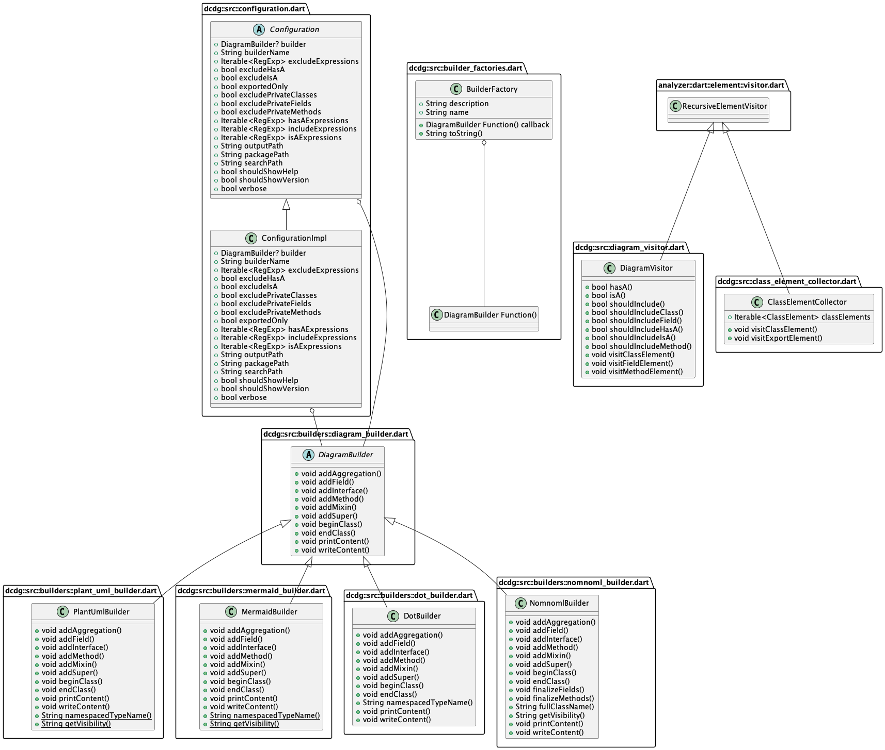

# Dart Class Diagram Generator

A small command line utility to generate a class (UML or similar) diagram from a
Dart package.

## Examples

Below is a UML diagram of the dcdg source code, created with dcdg. You can find
the PlantUML source in the `example/` directory.

## Installation

**Install from pub:**

`dart pub global activate dcdg`

**Install from clone:**

`dart pub global activate -s path .`

## Usage

From inside a Dart package directory:

`dart pub global run dcdg`

This will dump a PlantUML file to stdout. You can save it to a file
instead with the `-o` option.

See `--help` for more options, including ways to filter what ends up
in the output. You can find the help contents in [USAGE.txt](USAGE.txt)
as well.

### Examples

There are test fixtures in `test/fixtures/`. Each Dart package in this
directory contains various (fake) classes. Try running DCDG against these
fixtures to familiarize yourself with how it works.

## Contributing

Pull requests are welcome! It is intended to be reasonably straightforward to
add a new output format. Take a look at the DOT format implementation in
`lib/src/builders` for an example.

If you have found a bug or have a feature request please open an issue.

## Development

Format code using the `tool/format.sh` script. It will have a non-zero exit code
if the formatting changed. That's fine, it does that so it can be used in CI.

Run the full test suite (including unit and functional tests) with
`tool/check.sh`.

If you change the user interface or add features you should run `tool/docs.sh`
to regenerate documentation and other resources. This script requires
[PlantUML](https://plantuml.com/).

